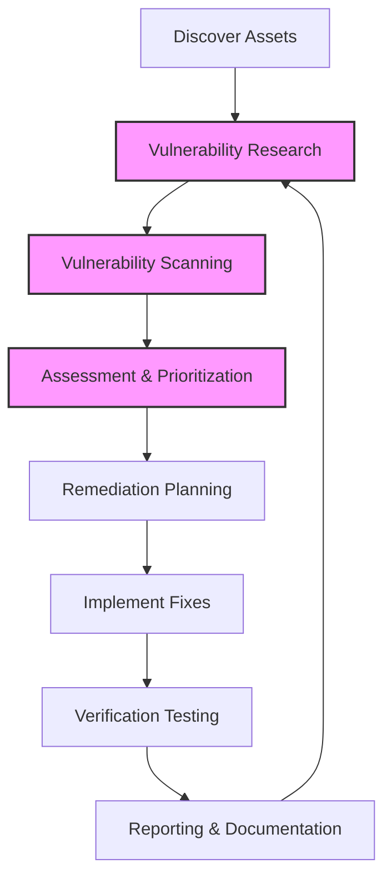

# Vulnerability Analysis

*Last Updated: 2025-04-03 01:34*

*Status: Complete*

*Tags: Security, Vulnerabilities, Assessment, Penetration Testing, Compliance*

## Introduction

Vulnerability analysis is the systematic process of identifying, classifying, and assessing security weaknesses in computer systems, networks, and applications. This document provides a comprehensive guide to vulnerability analysis concepts, methodologies, and practical implementation for security professionals and system administrators.

## Vulnerability Management Lifecycle



## Vulnerability Classification

Security vulnerabilities can be categorized into several types:

- **Misconfiguration**: Improper setup of systems or applications that creates security gaps
  - *Example*: Leaving default SSH ports open with password authentication enabled
  
- **Default Installations**: Systems deployed with out-of-box settings that contain known security weaknesses
  - *Example*: Apache server with default configurations exposing server version information

- **Buffer Overflow**: Memory corruption vulnerabilities where programs write beyond allocated memory boundaries
  - *Example*: The Heartbleed vulnerability in OpenSSL

- **Unpatched Servers**: Systems missing critical security updates and patches
  - *Example*: Windows servers vulnerable to EternalBlue (MS17-010)

- **Design Flaws**: Fundamental architectural weaknesses in system or application design
  - *Example*: JWT implementation without signature verification

- **Operating System Flaws**: Vulnerabilities specific to operating system components
  - *Example*: Windows Print Spooler vulnerabilities (PrintNightmare)

- **Application Flaws**: Security issues in software applications and services
  - *Example*: SQL injection in web applications

- **Open Services**: Unnecessarily exposed network services that increase attack surface
  - *Example*: Telnet service running on public-facing servers

- **Default Passwords**: Unchanged factory credentials that provide easy access points
  - *Example*: Default admin/admin credentials on network devices

## Vulnerability Analysis Process

The complete vulnerability analysis process consists of four main steps:

### 1. Vulnerability Research

Vulnerability research is the process of discovering vulnerabilities and design flaws that could expose operating systems and applications to attacks or misuse.

#### Importance for Administrators
Administrators need vulnerability research to:
- Gather information about security trends, threats, and attacks
- Find weaknesses and alert the network administrator before a network attack occurs
- Obtain information that helps prevent security problems
- Learn how to recover from network attacks

#### Research Resources
To check vulnerabilities using database websites:
- CVE (Common Vulnerabilities and Exposures)
- NVD (National Vulnerability Database)
- Security bulletins and advisories

#### Steps for Vulnerability Research
1. Identifying vulnerabilities
2. Checking for criticality of vulnerabilities and categorizing by severity
3. Identifying vulnerability dependencies and relationships

#### Example: Checking Vulnerability in a System
```
# Check service versions
nmap -sV target_ip

# Example finding: vsftpd 2.3.4 
# Research: https://www.cve.org/CVERecord?id=CVE-2011-2523
```

### 2. Categorizing Vulnerabilities

Vulnerabilities are typically classified by:
- **Security Level**: Low, Medium, High, Critical
- **Exploit Range**: Local, Adjacent Network, Network (Remote)
- **Impact Type**: Confidentiality, Integrity, Availability

#### Vulnerability Severity Systems
- **CVSS (Common Vulnerability Scoring System)**: Framework for communicating the severity characteristics and impacts
- **NIST Risk Matrix**: Combines likelihood and impact to determine overall risk level

### 3. Vulnerability Scanning

Vulnerability scanning is an inspection of potential points of exploit on computers or networks to identify security holes. The scanning software compares details about the target attack surface to a database of information about known security vulnerabilities.

#### Vulnerability Scanner Classification Methods
Vulnerability scanners typically classify vulnerabilities by:
- **Security Level**: Low, Medium, High, Critical
- **Exploit Range**: Local, Remote

#### Using Nmap for Vulnerability Detection

1. **Using vulnerability scripts**
   ```
   # Find vulnerability scripts
   locate *.nse | grep vulners
   
   # Example path
   /usr/share/legion/scripts/nmap/vulners.nse
   
   # Run vulnerability scan
   sudo nmap --script vulners 10.0.0.171 -sV
   ```

2. **Installing and using vulscan**
   ```
   # Navigate to scripts directory
   cd /usr/share/nmap/scripts
   
   # Clone the repository
   sudo git clone https://github.com/scipag/vulscan.git
   
   # Run vulscan
   sudo nmap --script vulscan/vulscan.nse 10.10.10.6 -sV
   ```

#### Checking Vulnerability Exploit Code
Resources for finding exploit code:
1. Exploit-DB: [https://www.exploit-db.com/](https://www.exploit-db.com/)
2. PacketStorm: [https://packetstorm.news/](https://packetstorm.news/)

### 4. Vulnerability Assessment

Vulnerability assessment is a comprehensive examination of the ability of a system or application, including current security procedures and controls, to withstand assault. It recognizes, measures, and classifies security vulnerabilities in computer systems, networks, and communications infrastructure.

## Zero-Day (0-Day) Exploits

A zero-day exploit targets a previously unknown vulnerability that has not yet been patched or disclosed publicly. The term "zero-day" refers to the fact that developers have had zero days to address and patch the vulnerability since its discovery.

Characteristics of zero-day exploits:
- Unknown to the software vendor or security community
- No patches or fixes are available
- Traditional signature-based security solutions cannot detect them
- Often command high prices in underground markets (ranging from $10,000 to $1 million+)
- Frequently used in targeted attacks or advanced persistent threats (APTs)
- Organizations have no advance warning to prepare defenses

### Zero-Day Lifecycle
1. Vulnerability discovery (by researcher or malicious actor)
2. Exploitation development
3. Use in targeted attacks
4. Discovery by security community or target
5. Disclosure to vendor
6. Patch development
7. Patch deployment

### Real-World Zero-Day Example
In 2020, the SolarWinds supply chain attack utilized multiple zero-day vulnerabilities to compromise thousands of organizations. The attackers exploited unknown vulnerabilities in the SolarWinds Orion software to deploy the SUNBURST backdoor, which remained undetected for months.

## Vulnerability Databases and Standards

- **CVE (Common Vulnerabilities and Exposures)**: Acts as a reference for publicly known information security vulnerabilities
- **NVD (National Vulnerabilities Database)**: Primary source for vulnerability information, maintained by NIST
- **MITRE**: NVD is managed by a branch of MITRE (Missile Test and Readiness Equipment)
- **CVSS (Common Vulnerability Scoring System)**: Used for communicating the characteristics of risks and their impact on IT systems

To check the criticality of vulnerabilities:
- CVEDetails: [https://www.cvedetails.com/](https://www.cvedetails.com/)
- Example search: CVE-2011-2523, Drupal 7 vulnerabilities

> Note: CWE refers to the core weakness of a product, while CVE refers to specific vulnerabilities in a product.

## Vulnerability Scanning Tools Comparison

| Tool | Type | Cost | Key Features | Limitations |
|------|------|------|--------------|-------------|
| **OpenVAS** | Open Source | Free | Comprehensive scanning, Web interface, Customizable scans | Resource intensive, Can be complex to set up |
| **Nessus** | Commercial (free tier) | Free for 16 IPs, Paid plans available | User-friendly, Accurate detection, Compliance checks | Limited free tier, Resource intensive |
| **Qualys** | Commercial | Paid | Cloud-based, Compliance focus, Asset discovery | Expensive, Enterprise-focused |
| **IBM Qradar VM** | Commercial | Paid | Integration with SIEM, Advanced analytics | Complex implementation, High cost |
| **Rapid7 Nexpose** | Commercial | Paid | Risk prioritization, Integration with Metasploit | Resource intensive, Learning curve |
| **Core Impact** | Commercial | Paid | Penetration testing integration, Low false positives | Very expensive, Specialized use case |

### Vulnerability Research Websites
- securityfocus.com
- vulnerability-lab.com
- us-cert.gov
- cvedetails.com

## Setting Up Nessus (Trial Version)

1. **Download Nessus Essentials**
   - Register at the Tenable website (can use mailinator.com for temporary email)
   - Save activation key (example: AD4A-6W2G-6C82-HFP5-GYFB)

2. **Installation (Debian-based systems)**
   ```
   # Install the downloaded package
   sudo dpkg -i [downloaded-package-name].deb
   
   # Start the Nessus service
   sudo service nessusd start
   ```

3. **Configuration**
   - Access the web interface at:
     - https://localhost:8834
     - https://kali:8834
     - https://[your_ip]:8834
   - Create username and password
     - Example: username - core5, password - Shift@09
   - Activate using the license key

4. **Running Nessus**
   ```
   sudo service nessusd start
   ```

5. **Scanning Limitations**
   - Nessus Essentials provides free scanning for up to 16 IP addresses
   - For additional scans, you can create new accounts

6. **Scan Configuration**
   - Create a scan policy or use predefined templates
   - Add target IP addresses
   - Execute the scan
   - Review and analyze results

## Troubleshooting Common Scanning Issues

| Issue | Symptoms | Potential Solutions |
|-------|----------|---------------------|
| **Connection Timeout** | Scan fails to reach target | Check network connectivity, firewall rules, target availability |
| **Credential Failure** | Authentication-based scans fail | Verify credentials, check account lockout policies |
| **High Resource Usage** | Scanner or target performance issues | Reduce scan scope, adjust thread settings, schedule during off-hours |
| **False Positives** | Inaccurate vulnerability reports | Verify findings manually, update scanner, use multiple tools |
| **Incomplete Scans** | Partial results or unexpected termination | Check network stability, increase timeouts, reduce scan scope |

### Example Resolution: Credential Issues
```
# For SSH authentication issues on Linux targets:
# Check SSH configuration on target
sudo nano /etc/ssh/sshd_config

# Ensure these settings are correct:
# PasswordAuthentication yes
# PermitRootLogin yes (for root scans, though not recommended for production)

# Restart SSH service
sudo systemctl restart sshd
```

## Vulnerability Assessment Results

### Alert Decision Table

| **Result**              | **Alert (Tool Detection)** | **Actual Vulnerability** | **Explanation**                                                            |
|-------------------------|----------------------------|--------------------------|----------------------------------------------------------------------------|
| **True Positive (TP)**  | Yes                        | Yes                      | The tool correctly detects a real vulnerability. ✅                         |
| **True Negative (TN)**  | No                         | No                       | The tool correctly identifies no vulnerability. ✅                          |
| **False Positive (FP)** | Yes                        | No                       | The tool falsely reports a vulnerability that doesn't exist. ⚠️ (False Alarm) |
| **False Negative (FN)** | No                         | Yes                      | The tool fails to detect an actual vulnerability. ❌ (Risky)                |

### Understanding Assessment Results
- **True Positive**: When the test says you have it and you actually have it.
- **True Negative**: When the test says you don't have it and you actually don't have it.
- **False Positive**: When the test says you have it but you actually don't have it.
- **False Negative**: When the test says you don't have it but you actually have it.

## Remediation Planning

After completing a vulnerability assessment, organizations should:

1. **Prioritize Vulnerabilities**
   - Focus on critical and high-severity issues first
   - Consider exploitability and potential impact

2. **Develop a Patching Strategy**
   - Create a schedule for applying updates
   - Test patches in development environments before production deployment

3. **Implement Compensating Controls**
   - Where patches aren't available, deploy alternative security measures
   - Consider network segmentation, access controls, and monitoring

4. **Verify Remediation**
   - Conduct follow-up scans to confirm vulnerabilities have been addressed
   - Perform penetration testing where appropriate

5. **Document Findings and Actions**
   - Maintain a vulnerability management database
   - Track remediation activities and timelines

## Real-World Remediation Example: Log4Shell Vulnerability

When the Log4Shell vulnerability (CVE-2021-44228) was discovered in December 2021, organizations faced a critical remote code execution vulnerability in the widely-used Log4j library.

### Immediate Response Actions:
1. **Identification**: Organizations scanned their environments to identify all instances of vulnerable Log4j versions
2. **Prioritization**: Internet-facing applications were prioritized for remediation
3. **Temporary Mitigation**: WAF rules and network blocks were implemented while patching was prepared
4. **Patching**: Systems were updated to Log4j 2.15.0 or newer
5. **Verification**: Post-remediation scanning confirmed the vulnerability was addressed
6. **Monitoring**: Enhanced monitoring for exploit attempts continued after remediation

## Compliance Mapping

Vulnerability management is a key requirement in various regulatory and security frameworks:

| Framework | Requirement | Vulnerability Management Component |
|-----------|-------------|-----------------------------------|
| **PCI DSS** | Requirement 6.1, 11.2 | Regular vulnerability scanning, patching critical systems |
| **NIST 800-53** | RA-5 | Vulnerability scanning, remediation tracking, and timely patching |
| **ISO 27001** | A.12.6.1 | Technical vulnerability management and implementation of patches |
| **HIPAA** | Security Rule | Regular risk assessment including vulnerability identification |
| **SOC 2** | Risk Management | Vulnerability identification and remediation process |
| **GDPR** | Article 32 | Technical measures to ensure appropriate security level |

## Best Practices for Ongoing Vulnerability Management

1. **Regular Scanning Schedule**
   - Implement continuous or frequent scheduled scanning
   - Scan after significant infrastructure changes

2. **Threat Intelligence Integration**
   - Incorporate threat feeds into vulnerability prioritization
   - Focus on actively exploited vulnerabilities

3. **Automated Remediation Workflows**
   - Develop standard operating procedures for common vulnerabilities
   - Automate patch deployment where possible

4. **Metrics and Reporting**
   - Track mean time to remediate (MTTR)
   - Monitor vulnerability aging (time since discovery)
   - Report on vulnerability trends and improvements

5. **Staff Training**
   - Educate development teams on secure coding practices
   - Train operations staff on secure configuration management

## Glossary of Terms

- **Attack Surface**: The sum of points where an unauthorized user can attempt to enter or extract data from an environment.
- **CVSS (Common Vulnerability Scoring System)**: A framework for communicating the characteristics and severity of software vulnerabilities.
- **CVE (Common Vulnerabilities and Exposures)**: A list of publicly disclosed computer security flaws.
- **CWE (Common Weakness Enumeration)**: A community-developed list of software and hardware weakness types.
- **Exploit**: A piece of software, data, or command that takes advantage of a vulnerability to cause unintended behavior.
- **False Positive**: An alert that incorrectly indicates a vulnerability is present.
- **False Negative**: Failure to detect an actual vulnerability.
- **MTTR (Mean Time to Remediate)**: The average time from vulnerability discovery to remediation.
- **Patch Management**: The process of distributing and applying updates to software.
- **Remediation**: The act of mitigating a vulnerability or security issue.
- **SIEM (Security Information and Event Management)**: Systems that provide real-time analysis of security alerts.
- **Vulnerability**: A weakness that can be exploited by threats to gain unauthorized access or perform unauthorized actions.
- **Zero-Day**: A previously unknown vulnerability that has not yet been patched or disclosed publicly.
